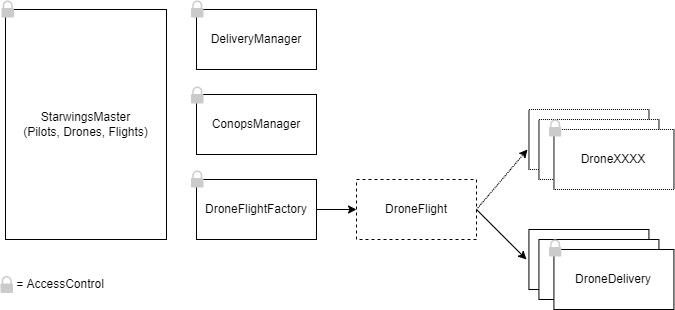

# Alyra Final Project - Design Pattern Decisions

&nbsp;

&nbsp;

# :city_sunrise: Contracts architecture

<p align="center">

</p>

&nbsp;

> **StarwingsMaster** : keeps main data like pilots, drones and flights

> **DeliveryManager** : is here to manage all data and operations related to deliveries

> **ConopsManager** : manage all data and operations related to Conops.

> **DroneFligthFactory** : is our factory to deploy flight session (see below for details)

As we will need to make new version, we kept things the most independant possible.
We can update each process independantly and refer to the new version using StarwingsMaster.

&nbsp;

# :factory: Factory pattern

Each flight session will have his own contract deployed at a unique address. For that we use a Factory `DroneFlightFactory` to deploy all `DroneDelivery` instances and keep track of all of them.

We also improved our factory by using CREATE2 opcode to be able to deploy contracts without storing child's contracts bytecode onchain.

&nbsp;

# :closed_lock_with_key: Access Control pattern

We are using **OpenZeppelin AccessControl** contract to manage rights on contracts functions for different roles.
We have 3 roles as of now :

-   Admin
-   Pilot
-   Drone

&nbsp;

# :construction: Randomness

We use a Randomness pattern to generate deliveries ids, using a mix of different variables to avoid rely only on `block.timestamp` and `blockhash`

Here is the code used in the DeliveryManager :

```js
_delivery.deliveryId = uint256(
    keccak256(
        abi.encodePacked(
            blockhash(block.number - 1),
            block.timestamp,
            _delivery.fromAddr,
            _delivery.toAddr,
            _delivery.supplierOrderId
        )
    )
).toHexString();
```

&nbsp;

# :loudspeaker: Fail early and fail loud

We tried to check as much possible inputs and behavior to throw exception before the code is executed.

&nbsp;

# :diamond_shape_with_a_dot_inside: State Machine pattern

We applied this pattern to our DroneFlight (inherited by DroneDelivery) to control the state of the flights and enable or disable actions under certain circumstances

&nbsp;

#

Sources :

-   https://fravoll.github.io/solidity-patterns/
-   https://docs.soliditylang.org/en/v0.8.11/common-patterns.html
-   https://www.linkedin.com/pulse/ethereum-solidity-smart-contract-design-patterns-wael-yousfi/

```

```
